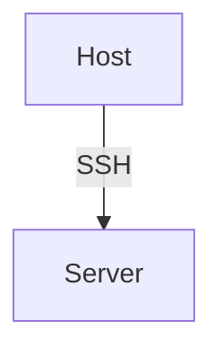

Ansible Build
===

 [](https://github.com/Mint-System/Ansible-Build/actions/workflows/test.yml) [](https://matrix.to/#/!BgzMVlwDExHDQPPdKJ:mint-system.ch?via=mint-system.ch)

The [Mint System](https://www.mint-system.ch/) collection of Ansible playbooks and roles.

## Requirements

* Setup [uv](https://docs.astral.sh/uv/)
* bash/zsh alias `task='./task'` with optional [completion](https://taskfile.build/#completion)

## Usage

Clone this repository.

```bash
git clone git@github.com:Mint-System/Ansible-Build.git
```

See `task help` or [task](./task.md) for details about the project commands.

### Setup

Navigate into the project folder.

```bash
cd Ansible-Build
```

Generate an Ansible vault id and password.

```bash
task generate-vault-password $VAULT_ID $PASSWORD
```

Create an Ansible configuration from the template.

```bash
cp ansible.cfg.template ansible.cfg
```

Install Ansible and Python dependencies.

```bash
task install
```

Create an inventory folder and configure a role.

[Ansbile Documentation > Build Your Inventory](https://docs.ansible.com/ansible/latest/network/getting_started/first_inventory.html)

### Roles

See [roles](./roles.md) for details or list the roles with:

```bash
task list-roles
```

### Targets

All Ansible roles can be deployed to a Linux Server via SSH.



### Ansible Vault

If you encrypt secrets with multiple vault identities, you can specificy the vault list in the `ansible.cfg` like this:

```toml
[defaults]
vault_identity_list = mint_system@.vault_pass_mint_system, sozialinfo@.vault_pass_sozialinfo
```

Or as an environment variable:

```bash
export ANSIBLE_VAULT_IDENTITY_LIST="mint_system@.vault_pass_mint_system, sozialinfo@.vault_pass_sozialinfo"
```

Alternatively you can configure the `--vault-id` parameter of the Ansible playbook command:

```bash
task play --vault-id mint_system@.vault_pass_mint_system ...
```

To decrypt single strings run this command:

```bash
task encrypt-string sozialinfo "vault_rolename_varname: secret"
```

### Deploy

Deploy the roles to the target hosts with the following commands.

List hosts in inventory.

```bash
task list-hosts inventories/setup
```

Load virtualenv.

```bash
source task source
```

Test connection.

```bash
ansible all -m ping -i inventories/odoo
```

Deploy multiple inventories.

```bash
task play -i inventories/setup -i inventories/odoo plays/odoo.yml
```

Deploy Odoo stack.

```bash
task play -i inventories/odoo plays/odoo.yml
```

Deploy role only.

```bash
task play -i inventories/odoo plays/odoo.yml -t postgres
```

Deploy without dependencies.

```bash
task play -i inventories/setup plays/setup.yml --skip-tags depends
```

Deploy role to specific host.

```bash
task play -i inventories/setup plays/setup.yml -t docker -l host.example.com
```

Deploy role to specific group with non-default user.

```bash
task play -i inventories/setup plays/setup.yml -t docker -l host.example.com -u username
```

Clean Odoo stack.

```bash
task play -i inventories/odoo plays/clean.yml.yml -t odoo,odoo_volume,odoo_data,postgres,postgres_volume
```

Clean role only.

```bash
task play -i inventories/setup plays/clean.yml.yml -t docker_network
```

Clean dry run.

```bash
task play -i inventories/odoo plays/odoo.yml -t odoo --check
```

List all Odoo databases.

```bash
ansible all -i inventories/odoo -a "docker-postgres-list -c {{ postgres_hostname }}"
```

## Development

This section is about developing the Ansible Build project.

### Quality

Lint the project using Ansible lint.

```bash
task lint
```

### Configuration

Whenever possible use env variables to configure the container.

**Env Config**

```yml
env:
  POSTGRES_USER: "{{ postgres_user }}"
  POSTGRES_PASSWORD: "{{ postgres_password }}"
  POSTGRES_DB: "{{ postgres_db }}"
```

### Data

To persist data use Docker volumes.

**Volume Mount**

Mount the folder without subfolder.

```yml
volumes:
  - "{{ postgres_volume_name }}:/var/lib/postgresql/data"
```

For Ansible config files use file mounts.

**Bind Mount**

```yml
volumes:
  - "{{ nginx_data_dir }}/:/etc/nginx/conf.d/:ro"
```

### Docs

Every role folder must contain a `README.md` file.

Mark fix-me-comments with `# FIXME: <your text>`.

### Naming Conventions

Role names must be lower case and may contain an `_`.

Vars that are stored in vaults are prefixed with `vault_`.

Template for role vars:

```yml
# Url to Docker repsitory
rolename_image:
rolename_hostname:
rolename_port:
rolename_volume_name: "{{ rolename_hostname }}"
rolename_data_dir: "/usr/share/{{ rolename_hostname }}"
rolename_password: "{{ vault_rolename_password }}"
```

The reference roles are [postgres](roles/postgres/README.md) and [odoo](roles/odoo/README.md).

### Role and Tags

Roles can have multiple tags.

**Example one tag**

To define a Postgres role, you would:

- Create role `postges`
- Assign the tag `postgres`
- Create a task file `postgres.yml`

**Example multiple tags**

To define a Nginx role with a config tag, you would:

- Create role `nginx`
- Assign the tags `nginx` and `nginx_config`
- Create the task files `nginx.yml` and `nginx_config.yml`

In the `main.yml` you would include the tasks as followed:

```yml
- name: "Include {{ role_name }} config tasks"
  include_tasks: "{{ role_name }}-config.yml"
  when: nginx_data_dir is defined
  tags:
    - nginx
    - nginx_config

- name: "Include {{ role_name }} tasks"
  include_tasks: "{{ role_name }}.yml"
  when: nginx_image is defined
  tags:
    - nginx
```

### Aliases

Whenever a role is applied to the same host multiple times, you can create multiple aliases for the same host. Append a selected suffix to make a distinction between the aliases:

* **main**: Production environment.
* **int**: Staging environment.
* **dev**: Development and test environment.
* **upgrade**: Upgrade environment.
* **dep**: Deprecated environment.

Here is an example of an host with two aliases:

```yml
all:
  hosts:
    zeus_web:
      ansible_host: zeus.mint-system.com
    zeus_main:
      ansible_host: zeus.mint-system.com
```
