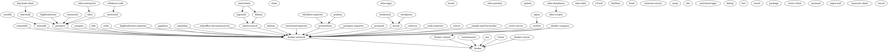

# Ansible Playbooks

[](https://github.com/Mint-System/Ansible-Playbooks/actions?query=workflow%3A"Ansible+Lint")

Collection of Ansible playbooks and roles.

## Roles

Role dependency graph: 



Role details:

| Role                                                                   | Description                                                      |
| ---------------------------------------------------------------------- | ---------------------------------------------------------------- |
| [blackbox-exporter](roles/blackbox-exporter/README.md)                 | Deploy Blackbox exporter container.                              |
| [bigbluebutton-exporter](roles/bigbluebutton-exporter/README.md)       | Deploy BigBlueButton exporter container.                         |
| [bigbluebutton](roles/bigbluebutton/README.md)                         | Install BigBlueButton with https and greenlight.                 |
| [bookstack](roles/bookstack/README.md)                                 | Deploy BookStack container.                                      |
| [cadvisor](roles/cadvisor/README.md)                                   | Deploy cAdvisor Docker container.                                |
| [certbot](roles/certbot/README.md)                                     | Deploy Let's Encrypt certificates.                               |
| [clean](roles/clean/README.md)                                         | Cleanup Ansible roles.                                           |
| [commento](roles/commento/README.md)                                   | Deploy Commento container.                                       |
| [debug](roles/debug/README.md)                                         | Debug Ansible variables.                                         |
| [docker-network](roles/docker-network/README.md)                       | Configure Docker network.                                        |
| [docker-volume](roles/docker-volume/README.md)                         | Configure Docker volume.                                         |
| [docker-swarm](roles/docker-swarm/README.md)                           | Configure Docker Swarm.                                          |
| [docker](roles/docker/README.md)                                       | Install Docker for Ubuntu and CentOS.                            |
| [elasticsearch](roles/elasticsearch/README.md)                         | Deploy ElasticSearch Docker cluster.                             |
| [fail2ban](roles/fail2ban/README.md)                                   | Install and configure fail2ban.                                  |
| [fstab](roles/fstab/README.md)                                         | Configure the fstab file.                                        |
| [grafana](roles/grafana/README.md)                                     | Deploy Grafana Docker container.                                 |
| [iam](roles/iam/README.md)                                             | Configures users and groups.                                     |
| [keycloak](roles/keycloak/README.md)                                   | Deploy Keycloak Docker container.                                |
| [kibana](roles/elasticsearch/README.md)                                | Deploy Kibana Docker container.                                  |
| [locale](roles/locale/README.md)                                       | Set system locale.                                               |
| [logstash](roles/logstash/README.md)                                   | Deploy Logstash Docker container.                                |
| [maintenance](roles/maintenance/README.md)                             | Maintain operating system and disk space.                        |
| [metricbeat](roles/metricbeat/README.md)                               | Deploy Metricbeat Docker container.                              |
| [moodle](roles/moodle/README.md)                                       | Deploy Moodle container.                                         |
| [mysql](roles/mysql/README.md)                                         | Deploy MySQL database container.                                 |
| [nextcloud-apps](roles/nextcloud-apps/README.md)                       | Install, update and remove Nextcloud apps.                       |
| [nextcloud-exporter](roles/nextcloud-exporter/README.md)               | Deploy Nextcloud exporter container.                             |
| [nextcloud](roles/nextcloud/README.md)                                 | Deploy Nextcloud container.                                      |
| [nginx-waf](roles/nginx-waf/README.md)                                 | Deploy Nginx with ModSecurity and Core Rule Set.                 |
| [nginx](roles/nginx/README.md)                                         | Deploy Nginx proxy with Certbot.                                 |
| [node-exporter](roles/node-exporter/README.md)                         | Deploy Node exporter container and install custom metric script. |
| [odoo-apps](roles/odoo-apps/README.md)                                 | Install Odoo apps from file, url, public or private GitHub repo. |
| [odoo-data](roles/odoo-data/README.md)                                 | Generate Odoo data modules.                                      |
| [odoo-enterprise](roles/odoo-enterprise/README.md)                     | Checkout the Odoo Enterprise git repository.                     |
| [odoo-scripts](roles/odoo-scripts/README.md)                           | Install Odoo scripts.                                            |
| [odoo](roles/odoo/README.md)                                           | Deploy Odoo container.                                           |
| [onlyoffice-documentserver](roles/onlyoffice-documentserver/README.md) | Deploy OnlyOffice Document Server container.                     |
| [openldap](roles/openldap/README.md)                                   | Deploy OpenLDAP Docker container.                                |
| [package](roles/package/README.md)                                     | Set env vars and install packages.                               |
| [pgadmin](roles/pgadmin/README.md)                                     | Install pgAdmin container.                                       |
| [postgres-exporter](roles/postgres-exporter/README.md)                 | Deploy PostgreSQL exporter container.                            |
| [postgres](roles/postgres/README.md)                                   | Deploy PostgreSQL database container.                            |
| [prometheus](roles/prometheus/README.md)                               | Deploy Prometheus Docker container.                              |
| [redis](roles/redis/README.md)                                         | Deploy Redis container.                                          |
| [remark42](roles/remark42/README.md)                                   | Deploy Remark42 container.                                       |
| [restic-client](roles/restic-client/README.md)                         | Configure Restic client backup jobs.                             |
| [restic-server](roles/restic-server/README.md)                         | Deploy Restic server container.                                  |
| [simple-mail-forwarder](roles/simple-mail-forwarder/README.md)         | Deploy Simple Mail Forwarder container container.                |
| [s3cmd](roles/s3cmd/README.md)                                         | Install and configure s3cmd.                                     |
| [ufw](roles/ufw/README.md)                                             | Configure UFW rules.                                             |
| [update](roles/update/README.md)                                       | Install system and package updates.                              |
| [vercel](roles/vercel/README.md)                                       | Manage vercel domain and dns entries.                            |

WIP:

* [docker-compose](roles/docker-compose/README.md) - Deploy Docker Compose project.
* [synapse](roles/synapse/README.md) - Deploy Matrix Synapse container.
* [coturn](roles/coturn/README.md) - Deploy Coturn container.
* [collabora-code](roles/collabora-code/README.md) - Deploy Collabora Code container.

## Usage

Clone this repository.

`git clone https://github.com/Mint-System/Ansible-Playbooks.git`

Set this the task alias.

`alias task=./task`

### Setup

Navigate to the playbook folder.

`cd Ansible-Playbooks`

Generate a password file for Ansible vault.

`task generate-passwordfile $PASSWORD`

Initialize and install Ansible.

`task init; task install-ansible`

Install Python and Ansible dependencies.

`task install-packages`

Create an inventory and configure a role.

[Ansbile Documentation > Build Your Inventory](https://docs.ansible.com/ansible/latest/network/getting_started/first_inventory.html)

### Deployment

List inventory

`ansible-inventory --list -y -i inventories/setup | grep -E 'ansible_host'`

Test connection

`ansible all -m ping -i inventories/odoo`

Deploy multiple inventories

`ansible-playbook -i inventories/setup -i inventories/odoo -i inventories/proxy odoo.yml`

Deploy Odoo stack

`ansible-playbook -i inventories/odoo odoo.yml`

Deploy role only

`ansible-playbook -i inventories/odoo odoo.yml -t postgres`

Deploy without dependencies

`ansible-playbook -i inventories/odoo odoo.yml --skip-tags depends`

Deploy role to specific host

`ansible-playbook -i inventories/odoo odoo.yml -t docker -l host.example.com`

Deploy role to specific group with non-default user

`ansible-playbook -i inventories/odoo docker.yml -t docker -l europe -u username`

Clean Odoo stack

`ansible-playbook -i inventories/odoo clean.yml -t odoo,odoo-volume,odoo-data-dir,postgres,postgres-volume`

Clean role only

`ansible-playbook -i inventories/odoo clean.yml -t docker-network`

Clean dry run

`ansible-playbook -i inventories/odoo odoo.yml -t odoo --check`

Install odoo-scripts and odoo-apps locally

`ansible-playbook -i inventories/odoo localhost.yml --skip-tags depends`

List all Odoo databses.

`ansible all -i inventories/odoo -a "docker-odoo-list -c {{ odoo_hostname }}"`

## Docs

### Quality

Lint the project using Ansible lint.

`task lint`

### Config

Whenever possible use env variables to configure the container.

**Env Config**

```yml
    env:
      POSTGRES_USER: "{{ postgres_user }}"
      POSTGRES_PASSWORD: "{{ postgres_password }}"
      POSTGRES_DB: "{{ postgres_db }}"
```

### Data

To persist data use Docker volumes.

**Volume Mount**

Mount the folder without subfolder.

```yml
    volumes:
      - "{{ postgres_volume_name }}:/var/lib/postgresql/data"
```

For Ansible config files use file mounts.

**Bind Mount**

```yml
    volumes:
      - "{{ nginx_data_dir }}/:/etc/nginx/conf.d/:ro"
```

### Guidelines

Every role folder must contain a `README.md` file.

Mark fix-me-comments with `# FIXME: <your text>`.

### Naming

Template for role vars:

```yml
# Basics:
# Url to Docker repsitory
ROLENAME_image: URL
ROLENAME_hostname: SHORTNAME + COUNTER
ROLENAME_port:
ROLENAME_volume_name: SHORTNAME_data + COUNTER
ROLENAME_data_dir: /usr/share/SHORTNAME + COUNTER
# Database connection:
ROLENAME_db_type: mysql
ROLENAME_db_user:
ROLENAME_db_password: "{{ vault_ROLENAME_db_password }}"
ROLENAME_db_hostname:
ROLENAME_db_name:
# Credentials user:
ROLENAME_user:
ROLENAME_password: "{{ vault_ROLENAME_password }}"
# Credentials admin:
ROLENAME_admin_user:
ROLENAME_admin_password: "{{ vault_ROLENAME_admin_password }}"
# Named database connection:
ROLENAME_postgres_hostname:
ROLENAME_postgres_user:
ROLENAME_postgres_password: "{{ vault_ROLENAME_postgres_password }}"
# SMTP
ROLENAME_smtp_hostname:
ROLENAME_smtp_auth:
ROLENAME_smtp_secure:
ROLENAME_smtp_port:
ROLENAME_smtp_domain:
ROLENAME_smtp_from:
ROLENAME_smtp_username:
ROLENAME_smtp_password:
```

Role names must be lower case and may contain a `-`.

### Role and Tags

Roles can have multiple tags.

**example one tag**

To define a Postgres role, you would:
* Create role `postges`
* Assign the tag `postgres`
* Create a task file `postgres.yml`

**example multiple tags**

To define a Nginx role with a config tag, you would:
* Create role `nginx`
* Assign the tags `nginx` and `nginx-config`
* Create the task files `nginx.yml` and `nginx-config.yml`

In the `main.yml` you would include the tasks as followed:

```yml
- name: "Include {{ role_name }} config tasks"
  include_tasks: "{{ role_name }}-config.yml"
  when: nginx_data_dir is defined
  tags:
    - nginx
    - nginx-config

- name: "Include {{ role_name }} tasks"
  include_tasks: "{{ role_name }}.yml"
  when: nginx_image is defined
  tags:
    - nginx
```
