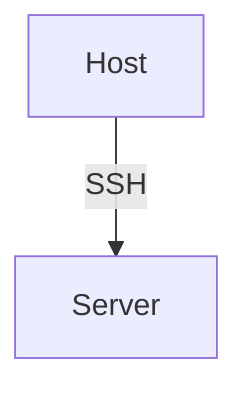

# Ansible Build

The [Mint System](https://www.mint-system.ch/) collection of Ansible playbooks and roles.

## Requirements

* Install python 3.8+ with [pyenv](https://github.com/pyenv/pyenv-installer)
* bash/zsh alias `task='./task'` with optional [completion](https://github.com/janikvonrotz/dotfiles/blob/master/oh-my-zsh-completions/_task)

## Usage

Clone this repository.

`git clone git@github.com:Mint-System/Ansible-Build.git`

See `task help` or [task](./task.md) for details about the project commands.

### Setup

Navigate into the project folder.

`cd Ansible-Build`

Generate an Ansible vault id and password.

`task generate-vault-password $VAULT_ID $PASSWORD`

Create an Ansible configuration from the template.

`cp ansible.cfg.template ansible.cfg`

Install Ansible and Python dependencies.

`task install`

Create an inventory folder and configure a role.

[Ansbile Documentation > Build Your Inventory](https://docs.ansible.com/ansible/latest/network/getting_started/first_inventory.html)

### Roles

Have a look at the Ansible roles and check how to configure them.

| Role                                                                   | Description                                                      |
| ---------------------------------------------------------------------- | ---------------------------------------------------------------- |
| [acme_sh](roles/acme_sh/README.md)                                     | Issue & renew the free certificates.                             |
| [alertmanager](roles/alertmanager/README.md)                           | Deploy Alertmanager container.                                   |
| [ansible_scripts](roles/ansible_scripts/README.md)                     | Install Ansible scripts.                                         |
| [bigbluebutton](roles/bigbluebutton/README.md)                         | Install BigBlueButton with https and greenlight.                 |
| [bigbluebutton_exporter](roles/bigbluebutton_exporter/README.md)       | Deploy BigBlueButton exporter container.                         |
| [birt](roles/birt/README.md)                                           | Deploy BIRT container.                                           |
| [blackbox_exporter](roles/blackbox_exporter/README.md)                 | Deploy Blackbox exporter container.                              |
| [bookstack](roles/bookstack/README.md)                                 | Deploy BookStack container.                                      |
| [cadvisor](roles/cadvisor/README.md)                                   | Deploy cAdvisor Docker container.                                |
| [cargo](roles/cargo/README.md)                                         | Setup Rust toolchain and cargo package manager.                  |
| [certbot](roles/certbot/README.md)                                     | Deploy Let's Encrypt certificates.                               |
| [clean](roles/clean/README.md)                                         | Cleanup Ansible roles.                                           |
| [collabora_code](roles/collabora_code/README.md)                       | Deploy Collabora Code container.                                 |
| [commento](roles/commento/README.md)                                   | Deploy Commento container.                                       |
| [coturn](roles/coturn/README.md)                                       | Deploy Coturn cotainer.                                          |
| [cron](roles/cron/README.md)                                           | Setup cron jobs.                                                 |
| [crowdsec](roles/crowdsec/README.md)                                   | Deploy crowdsec container.                                       |
| [debug](roles/debug/README.md)                                         | Debug Ansible variables.                                         |
| [dind](roles/dind/README.md)                                           | Deploy Docker in Docker container.                               |
| [docker](roles/docker/README.md)                                       | Install Docker for Ubuntu and CentOS.                            |
| [docker_compose](roles/docker_compose/README.md)                       | Deploy Docker Compose project.                                   |
| [docker_hosts](roles/docker_hosts/README.md)                           | Docker hostname resolver.                                        |
| [docker_network](roles/docker_network/README.md)                       | Configure Docker network.                                        |
| [docker_swarm](roles/docker_swarm/README.md)                           | Configure Docker Swarm.                                          |
| [docker_volume](roles/docker_volume/README.md)                         | Configure Docker volume.                                         |
| [dozzle](roles/dozzle/README.md)                                       | Deploy Dozzle container.                                         |
| [dribdat](roles/dribdat/README.md)                                     | Deploy dribdat container.                                        |
| [elasticsearch](roles/elasticsearch/README.md)                         | Deploy Elasticsearch Docker cluster.                             |
| [fail2ban](roles/fail2ban/README.md)                                   | Install and configure fail2ban.                                  |
| [fathom](roles/fathom/README.md)                                       | Deploy Fathom container.                                         |
| [fstab](roles/fstab/README.md)                                         | Configure the fstab file.                                        |
| [git](roles/git/README.md)                                             | Checkout Git repositories.                                       |
| [gitea](roles/gitea/README.md)                                         | Deploy Gitea container.                                          |
| [grafana](roles/grafana/README.md)                                     | Deploy Grafana Docker container.                                 |
| [hosts](roles/hosts/README.md)                                         | Add entries to hosts files.                                      |
| [htpasswd](roles/htpasswd/README.md)                                   | Configure .htpasswd basic auth file.                             |
| [iam](roles/iam/README.md)                                             | Configures users and groups.                                     |
| [innernet](roles/innernet/README.md)                                   | Setup WireGuard based internal network.                          |
| [jenkins](roles/jenkins/README.md)                                     | Deploy Jenkins container.                                        |
| [k3s](roles/k3s/README.md)                                             | Deploy Kubernetes cluster with K3s.                              |
| [keycloak](roles/keycloak/README.md)                                   | Deploy Keycloak Docker container.                                |
| [keycloak_client](roles/keycloak_client/README.md)                     | Configure Keycloak client.                                       |
| [kibana](roles/elasticsearch/README.md)                                | Deploy Kibana Docker container.                                  |
| [locale](roles/locale/README.md)                                       | Set system locale.                                               |
| [logstash](roles/logstash/README.md)                                   | Deploy Logstash Docker container.                                |
| [loki](roles/loki/README.md)                                           | Deploy Loki container.                                           |
| [mailhog](roles/mailhog/README.md)                                     | Deploy MailHog Docker container.                                 |
| [mailpit](roles/mailpit/README.md)                                     | Deploy Mailpit Docker container.                                 |
| [maintenance](roles/maintenance/README.md)                             | Maintain operating system and disk space.                        |
| [mariadb](roles/mariadb/README.md)                                     | Deploy MariaDB database container.                               |
| [matomo](roles/matomo/README.md)                                       | Deploy Matomo container.                                         |
| [meilisearch](roles/meilisearch/README.md)                             | Deploy Meilisearch container.                                    |
| [metabase](roles/metabase/README.md)                                   | Deploy Metabase Docker container.                                |
| [metricbeat](roles/metricbeat/README.md)                               | Deploy Metricbeat Docker container.                              |
| [moodle](roles/moodle/README.md)                                       | Deploy Moodle container.                                         |
| [mysql](roles/mysql/README.md)                                         | Deploy MySQL database container.                                 |
| [n8n](roles/n8n/README.md)                                             | Deploy N8N container.                                            |
| [n8n_exporter](roles/n8n_exporter/README.md)                           | Add nginx config for N8N exporter path.                          |
| [nextcloud](roles/nextcloud/README.md)                                 | Deploy Nextcloud container.                                      |
| [nextcloud_apps](roles/nextcloud_apps/README.md)                       | Install, update and remove Nextcloud apps.                       |
| [nextcloud_exporter](roles/nextcloud_exporter/README.md)               | Deploy Nextcloud exporter container.                             |
| [nginx](roles/nginx/README.md)                                         | Deploy Nginx proxy with Certbot.                                 |
| [nginx_waf](roles/nginx_waf/README.md)                                 | Deploy Nginx with ModSecurity and Core Rule Set.                 |
| [node_exporter](roles/node_exporter/README.md)                         | Deploy Node exporter container and install custom metric script. |
| [odoo](roles/odoo/README.md)                                           | Deploy Odoo container.                                           |
| [odoo_apps](roles/odoo_apps/README.md)                                 | Install Odoo apps from file or url.                              |
| [odoo_data](roles/odoo_data/README.md)                                 | Generate Odoo data modules.                                      |
| [odoo_enterprise](roles/odoo_enterprise/README.md)                     | Checkout the Odoo Enterprise git repository.                     |
| [odoo_exporter](roles/odoo_exporter/README.md)                         | Add nginx config for Odoo exporter path.                         |
| [odoo_patches](roles/odoo_patches/README.md)                           | Apply custom Odoo patches.                                       |
| [odoo_repos](roles/odoo_repos/README.md)                               | Setup Odoo modules public or private GitHub repo.                |
| [odoo_scripts](roles/odoo_scripts/README.md)                           | Install Odoo scripts.                                            |
| [onlyoffice_documentserver](roles/onlyoffice_documentserver/README.md) | Deploy OnlyOffice Document Server container.                     |
| [openldap](roles/openldap/README.md)                                   | Deploy OpenLDAP Docker container.                                |
| [packages](roles/packages/README.md)                                   | Set env vars and install packages.                               |
| [pgadmin](roles/pgadmin/README.md)                                     | Deploy pgAdmin container.                                        |
| [php_fpm](roles/php_fpm/README.md)                                     | Deploy PHP-FPM container.                                        |
| [postfix](roles/postfix/README.md)                                     | Deploy Postfix relay host.                                       |
| [postgres](roles/postgres/README.md)                                   | Deploy PostgreSQL database container.                            |
| [postgres_exporter](roles/postgres_exporter/README.md)                 | Deploy PostgreSQL exporter container.                            |
| [prometheus](roles/prometheus/README.md)                               | Deploy Prometheus Docker container.                              |
| [promtail](roles/promtail/README.md)                                   | Deploy Promtail container.                                       |
| [rabbit](roles/rabbitmq/README.md)                                     | Deploy RabbitMQ container.                                       |
| [rclone](roles/rclone/README.md)                                       | Sync files with RClone.                                          |
| [redis](roles/redis/README.md)                                         | Deploy Redis container.                                          |
| [remark42](roles/remark42/README.md)                                   | Deploy Remark42 container.                                       |
| [resolv](roles/resolv/README.md)                                       | Manage resolv configuration.                                     |
| [restic](roles/restic/README.md)                                       | Configure Restic backup jobs.                                    |
| [restic_server](roles/restic_server/README.md)                         | Deploy Restic server container.                                  |
| [s3cmd](roles/s3cmd/README.md)                                         | Install and configure s3cmd.                                     |
| [simple_mail_forwarder](roles/simple_mail_forwarder/README.md)         | Deploy Simple Mail Forwarder container container.                |
| [superset](roles/superset/README.md)                                   | Deploy Apache Superset container.                                |
| [systemd](roles/systemd/README.md)                                     | Setup systemd service.                                           |
| [timezone](roles/timezone/README.md)                                   | Define timezone.                                                 |
| [ufw](roles/ufw/README.md)                                             | Configure UFW rules.                                             |
| [update](roles/update/README.md)                                       | Install system and package updates.                              |
| [vercel](roles/vercel/README.md)                                       | Manage vercel domain and dns entries.                            |
| [wordpress](roles/wordpress/README.md)                                 | Deploy WordPress container.                                      |

### Targets

All Ansible roles can be deployed to a Linux Server via SSH.



Some Ansible roles can be deployed to a Kubernetes Cluster.

### Ansible Vault

If you encrypt secrets with multiple vault identities, you can specificy the vault list in the `ansible.cfg` like this:

```toml
[defaults]
vault_identity_list = mint_system@.vault_pass_mint_system, sozialinfo@.vault_pass_sozialinfo
```

Or as an environment variable:

```bash
export ANSIBLE_VAULT_IDENTITY_LIST="mint_system@.vault_pass_mint_system, sozialinfo@.vault_pass_sozialinfo"
```

Alternatively you can configure the `--vault-id` parameter of the Ansible playbook command:

```bash
ansible-playbook --vault-id mint_system@.vault_pass_mint_system ...
```

To decrypt single strings run this command:

```bash
task encrypt-string sozialinfo "vault_rolename_varname: secret"
```

### Deploy

Deploy the roles to the target hosts with the following commands.

List hosts in inventory.

```bash
task list-hosts inventories/setup
```

Load virtualenv.

```bash
source task source
```

Test connection.

```bash
ansible all -m ping -i inventories/odoo
```

Deploy multiple inventories.

```bash
ansible-playbook -i inventories/setup -i inventories/odoo plays/odoo.yml
```

Deploy Odoo stack.

```bash
ansible-playbook -i inventories/odoo plays/odoo.yml
```

Deploy role only.

```bash
ansible-playbook -i inventories/odoo plays/odoo.yml -t postgres
```

Deploy without dependencies.

```bash
ansible-playbook -i inventories/setup plays/setup.yml --skip-tags depends
```

Deploy role to specific host.

```bash
ansible-playbook -i inventories/setup plays/setup.yml -t docker -l host.example.com
```

Deploy role to specific group with non-default user.

```bash
ansible-playbook -i inventories/setup plays/setup.yml -t docker -l host.example.com -u username
```

Clean Odoo stack.

```bash
ansible-playbook -i inventories/odoo plays/clean.yml.yml -t odoo,odoo_volume,odoo_data,postgres,postgres_volume
```

Clean role only.

```bash
ansible-playbook -i inventories/setup plays/clean.yml.yml -t docker_network
```

Clean dry run.

```bash
ansible-playbook -i inventories/odoo plays/odoo.yml -t odoo --check
```

Install odoo_scripts and odoo_apps locally.

```bash
ansible-playbook -i inventories/setup plays/localhost.yml.yml --skip-tags depends
```

List all Odoo databses.

```bash
ansible all -i inventories/odoo -a "docker-postgres-list -c {{ postgres_hostname }}"
```

### Kubernetes

Setup the following and the role's Kubernetes variables in your localhost inventory.

```yml
k8s_kubeconfig: /home/$USERNAME/.kube/config
k8s_namespace: default
```

Run the Kubernetes playbook for localhost.

```bash
ansible-playbook -i inventories/k8s plays/k8s.yml.yml -l localhost
```

## Development

This section is about developing the Ansible Build project. 

### Quality

Lint the project using Ansible lint.

```bash
task lint
```

### Configuration

Whenever possible use env variables to configure the container.

**Env Config**

```yml
env:
  POSTGRES_USER: "{{ postgres_user }}"
  POSTGRES_PASSWORD: "{{ postgres_password }}"
  POSTGRES_DB: "{{ postgres_db }}"
```

### Data

To persist data use Docker volumes.

**Volume Mount**

Mount the folder without subfolder.

```yml
volumes:
  - "{{ postgres_volume_name }}:/var/lib/postgresql/data"
```

For Ansible config files use file mounts.

**Bind Mount**

```yml
volumes:
  - "{{ nginx_data_dir }}/:/etc/nginx/conf.d/:ro"
```

### Docs

Every role folder must contain a `README.md` file.

Mark fix-me-comments with `# FIXME: <your text>`.

### Naming Conventions

Role names must be lower case and may contain an `_`.

Vars that are stored in vaults are prefixed with `vault_`.

Template for role vars:

```yml
# Url to Docker repsitory
rolename_image:
rolename_hostname:
rolename_port:
rolename_volume_name: "{{ rolename_hostname }}"
rolename_data_dir: "/usr/share/{{ rolename_hostname }}"
rolename_password: "{{ vault_rolename_password }}"
```

The reference roles are [postgres](roles/postgres/README.md) and [odoo](roles/odoo/README.md).

### Role and Tags

Roles can have multiple tags.

**example one tag**

To define a Postgres role, you would:

- Create role `postges`
- Assign the tag `postgres`
- Create a task file `postgres.yml`

**example multiple tags**

To define a Nginx role with a config tag, you would:

- Create role `nginx`
- Assign the tags `nginx` and `nginx_config`
- Create the task files `nginx.yml` and `nginx_config.yml`

In the `main.yml` you would include the tasks as followed:

```yml
- name: "Include {{ role_name }} config tasks"
  include_tasks: "{{ role_name }}-config.yml"
  when: nginx_data_dir is defined
  tags:
    - nginx
    - nginx_config

- name: "Include {{ role_name }} tasks"
  include_tasks: "{{ role_name }}.yml"
  when: nginx_image is defined
  tags:
    - nginx
```

### Aliases

Whenever a role is applied to the same host multiple times, you can create multiple aliases for the same host. Append a selected suffix to make a distinction between the aliases:

* **main**: Production environment.
* **int**: Staging environment.
* **dev**: Development and test environment.
* **upgrade**: Upgrade environment.
* **dep**: Deprecated environment.

Here is an example of an host with two aliases:

```yml
all:
  hosts:
    zeus_web:
      ansible_host: zeus.mint-system.com
    zeus_main:
      ansible_host: zeus.mint-system.com
```
